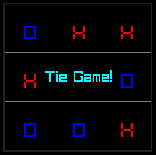

# Unbeatable Tic-tac-toe
Computer Tic-tac-toe written in Rust with [raylib-rs](https://github.com/deltaphc/raylib-rs). Uses bitboards and the minimax algorithm.

## Screenshot

## License
- The code of this project is released under the [GPLv3 license](./LICENSE) (or any later version).

